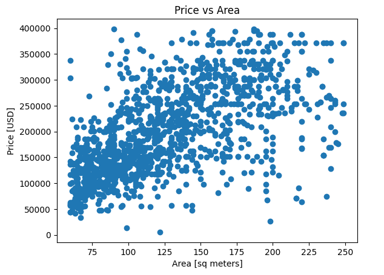
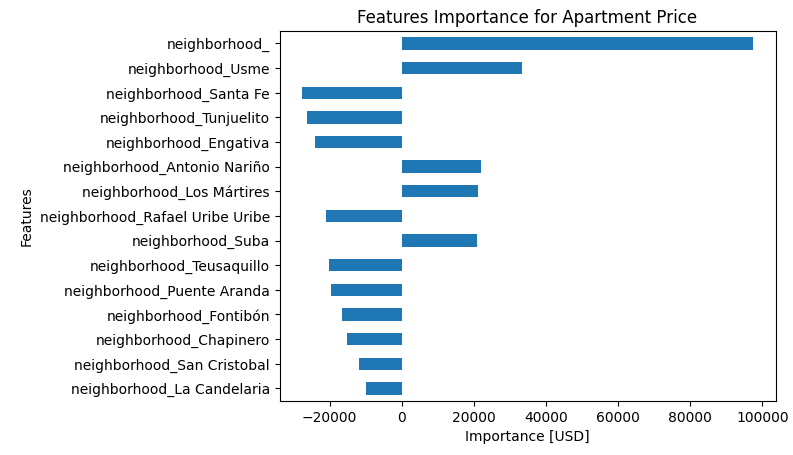

# Housing-in-Colombia

---
## Intrduction
Our objective for this project was to develop a machine learning model that accurately predicts house prices under $400,000 in Bogotá, Colombia. We utilized Linear Regression and Ridge Regression models to achieve this and evaluated our results using the Mean Absolute Error (MAE) metric.

## Dataset and Data Preprocessing 

The dataset we used was scrapped from the real estate website [Properati.com](https://properati.com/).

In the data preprocessing phase, We used the SimpleImputer transformer to deal with the missing values. And to deal with categorical feature encoding, we used the OneHotEncoder transformer.

We took several steps to optimize our dataset. We clipped the outliers and split the lat-lon feature into separate columns for latitude and longitude, converting their data type from object to float. Additionally, we removed features with high cardinality, leakage concerns, and multicollinearity. The whole process is written in a wrangle function.

## Exploratory Data Analysis

Our focus was on studying the correlation between the price of a house and three specific characteristics.

### House Area
It is clear that area and price are closely linked, as demonstrated in this plot:

### Location in Terms of Latitude and Longitude
To analyze this correlation, a map chart has been created:

Based on the map, it is clear that heading north will result in a significant increase in projected prices. On the other hand, traveling westward will lead to a noticeable decrease in predicted prices.

### Location in Terms of Neighborhood
This visual representation depicts how the location of a house within a neighborhood can influence its price:

## Modeling
Our project involved the construction of various models to achieve our goals. We began with the baseline model and then proceeded to implement several other models, including linear regression with surface_covered_in_m2 as a feature, linear regression with latitude and longitude as features, linear regression with "neighborhood" as a feature, and a Ridge model that incorporated all previous features. 

Our primary objective was to approximate the price in USD, and we were determined to achieve it with each of these models.

To enhance our predictors and handle missing data and categorical attributes, we opted for a pipeline model design that incorporates transformers.

### Training and Evaluation
To ensure our model's accuracy, we underwent a three-step process. First, we trained it with training data. Next, we tested it on the same training data. Finally, we evaluated its ability to generalize by testing it on separate test data. 

## Results
Model | Baseline |Mean Absolute Error
------|--|--------------------------------
Linear Regression with Area | 72274.36 | 52093.88
Linear Regression with Location | 72274.36 | 69170.32
Linear Regression with Neighborhood | 86347.16 | 84324.66
Ridge with Neighborhood | 86347.16 | 84117.51
Ridge with Everything | 86347.16 | 84203.94

Our optimal model incorporates both the area feature and linear regression algorithm.

## Conclusion
Our goal was to create a regression model capable of predicting house prices in Bogata, the capital of Colombia. We successfully worked through the project to achieve this objective.

In a next work session, we can boost our performance and achieve better results by integrating more regression algorithms and fine-tuning their hyperparameters.

